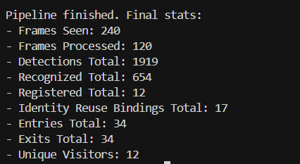
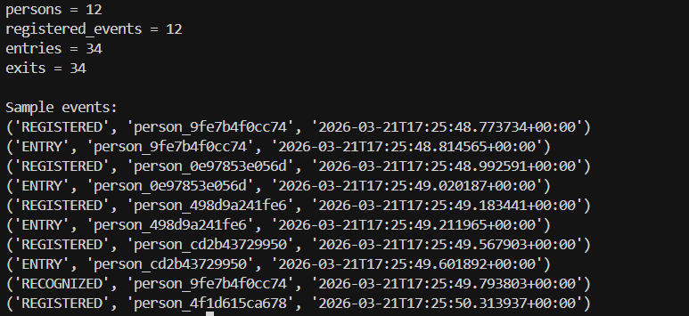
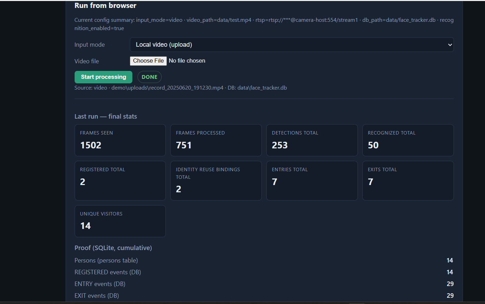
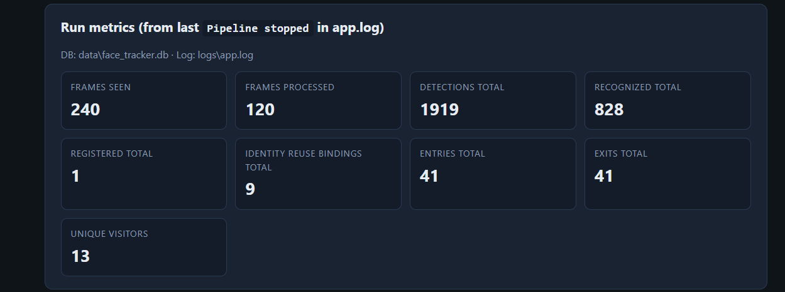
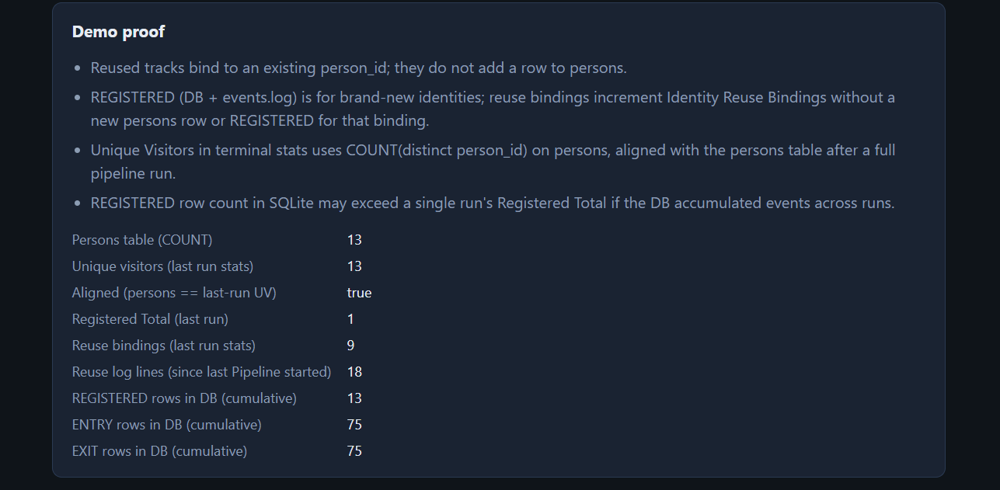
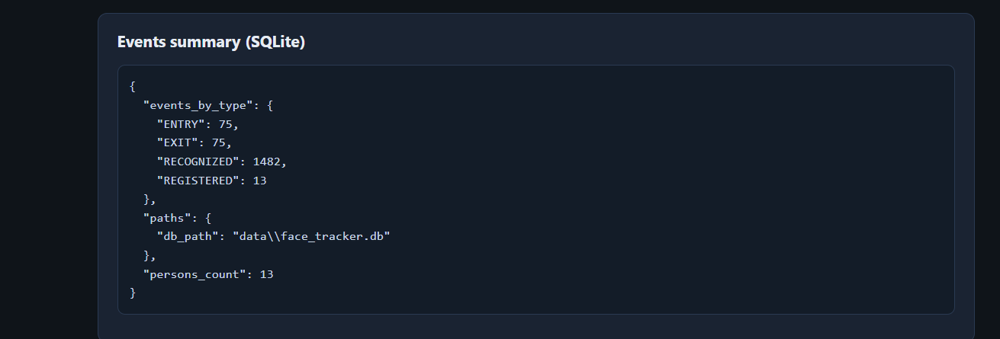

    # Sample Output

This document shows sample outputs produced by the Intelligent Face Tracker from a clean test run using the default local video input.

Input used:
- `data/test.mp4`

The output proof includes:
- final terminal statistics
- SQLite DB proof
- saved entry and exit crop images
- demo dashboard screenshots
- saved log files

---

## 1. Terminal Final Statistics

The following screenshot shows the final pipeline summary printed after processing the sample video.

This confirms that the pipeline completed successfully and produced final counts for frames, detections, recognition, registrations, entries, exits, and unique visitors.

---

## 2. SQLite Database Proof

The following screenshot shows sample database output after the same run.

This demonstrates that the system persisted person records and event records into SQLite.  
It also shows that `REGISTERED`, `ENTRY`, and `EXIT` events were written to the database.

---

## 3. Saved Entry Crop Images

The application saves cropped face images for entry events.

This provides sample visual proof that entry-related face crops were captured and saved during the run.

---

## 4. Saved Exit Crop Images

The application also saves cropped face images for exit events.

This provides sample visual proof that exit-related face crops were captured and stored.

---

## 5. Demo Dashboard Screenshots

The Flask demo dashboard displays proof-oriented outputs from the same project.

### Dashboard view 1

### Dashboard view 2

### Dashboard view 3

### Dashboard view 4

These screenshots show the lightweight frontend used to review run results, proof summaries, and stored outputs.

---

## 6. Sample Log Files

The run also produced structured log files saved under `docs/sample_outputs/logs/`.

- [Sample app log](sample_outputs/logs/sample_app.log)
- [Sample events log](sample_outputs/logs/sample_events.log)

The app log shows operational pipeline information such as pipeline start, pipeline stop, resource usage, and emitted events.  
The events log shows machine-readable event records such as `RECOGNIZED`, `ENTRY`, `EXIT`, and `REGISTERED`.

---

## 7. Summary

These sample outputs demonstrate that the project produces all major proof artifacts expected for the submission:

- terminal run output
- database records
- saved face crop images
- structured logs
- dashboard proof view

Together, these outputs show that the system is functioning end-to-end on a sample local video input.